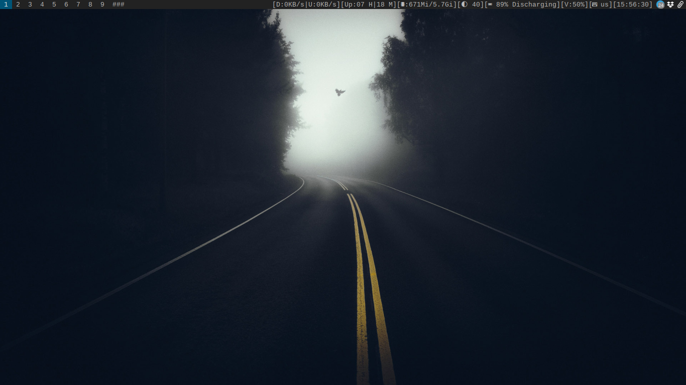
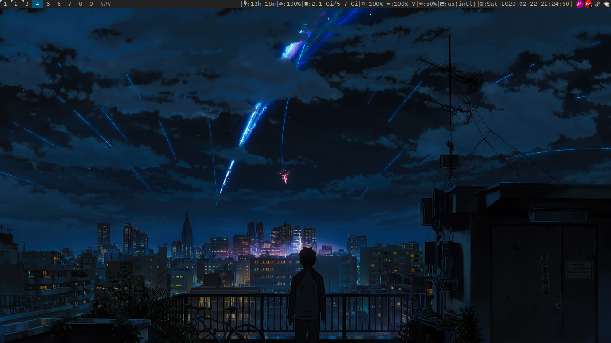

**dwm - dynamic window manager**
============================
dwm is an extremely fast, small, and dynamic window manager for X.


**Requirements:**
------------
In order to build dwm you need the Xlib header files.

Optionally you need:

```setxkbmap```

```scrot```

```xinput```

```xsetroot```

[syspoweradmin](https://github.com/brookiestein/syspoweradmin/)

[slock](https://github.com/brookiestein/slock/)

**Note that there are a number of keyboard shortcuts that you may not need.**

In that case, tell them or delete them directly.

**If you use this setting, these keyboard shortcuts might interest you:**
```
Windows key + Shift key + X = Set keyboard layout in Latin American Spanish
Windows key + Shift key + Z = Set keyboard layout in alternative American English

# For these keyboard shortcuts you will need: syspoweradmin
Turn off Botton = Shown window with options for: Shutdown and/or reboot the system.

# The following keyboard shortcuts are shortcuts to the functions offered by the previous keyboard
# shortcut. In other words, the window is not shown and the corresponding signal is output directly.
Windows key + Control key + Shift key + Turn off Botton = Turn off the system
Windows key + Control key + Shift key + Delete key = Reboot the system

# Check out what xinput shows and change id 12 in the config.h for your touchpad
Windows key + Control key + Shift key + Tab key = Enable touchpad
Windows key + Control key + Shift key + Enter = Disable touchpad
```
**In this configuration the keyboard shortcut was changed to exit the environment to:**
```
Windows key + Shift key + e
```
**And to close a window:**
```
Windows key + Shift key + q
```
**For reboot dwm**
```
Windows key + Shift key + r
```

**The alacritty terminal is used**

**In regards to the status bar. Look at my repository of 
[dotfiles.](https://github.com/brookiestein/dotfiles/tree/master/.config/dwm/)**

**Also, you can use [slstatus.](https://github.com/brookiestein/slstatus/)**

**Installation**
------------
Edit config.mk to match your local setup (dwm is installed into
the /usr/local namespace by default).

Afterwards enter the following command to build and install dwm (if
necessary as root):
```
# for i in $(ls -1 patches/); do patch -i patches/$i; done
# make clean install
```

**Running dwm**
-----------
Add the following line to your .xinitrc to start dwm using startx:
```
exec dwm
```
In order to connect dwm to a specific display, make sure that
the DISPLAY environment variable is set correctly, e.g.:
```
DISPLAY=foo.bar:1 exec dwm
```
(This will start dwm on display :1 of the host foo.bar.)

**How be will show the status bar, will depend of which you choose.**

If you choosed the first option, is say:
My repository of [dwmrc](https://github.com/brookiestein/dotfiles/tree/master/.config/dwm/)

Then you can do something like this in your .xinitrc:
```
DIR=${HOME}/.dwm
if [ -f "${DIR}"/dwmrc ]; then
        /bin/sh "${DIR}"/dwmrc &
else
        while xsetroot -name "`date` `uptime | sed 's/.*,//'`"; do
              sleep 1
        done &
fi
exec dwm
```

In case of that you choosed [slstatus:](https://github.com/brookiestein/slstatus)

**Only add this to your .xinitrc:**
```
slstatus &
```

**Configuration**
-------------
The configuration of dwm is done by creating a custom config.h
and (re)compiling the source code.

**Some screenshots:**

**With dwmrc statusbar**


**With slstatus**

